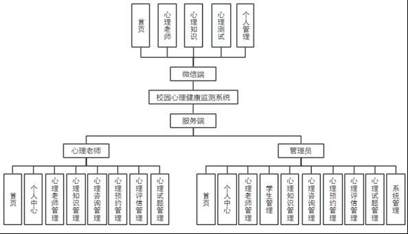
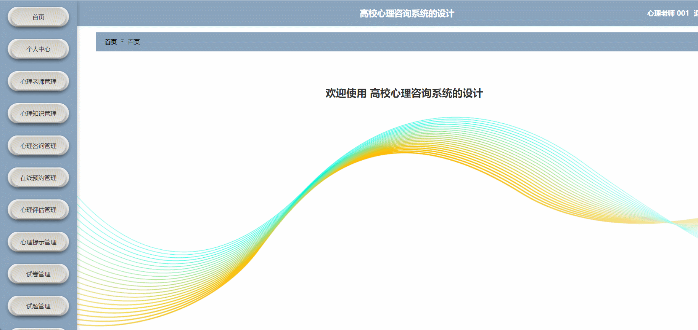
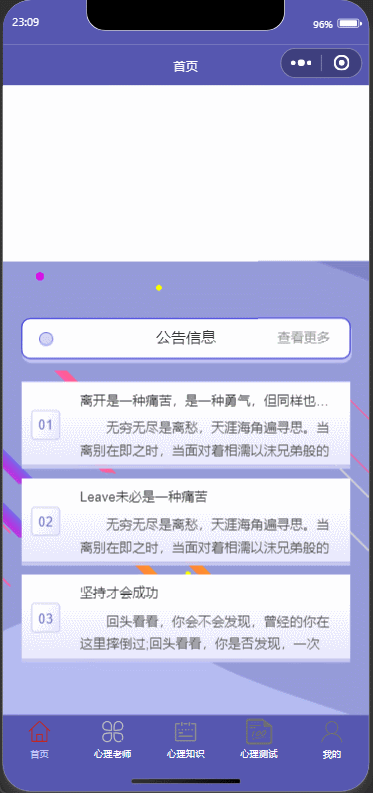
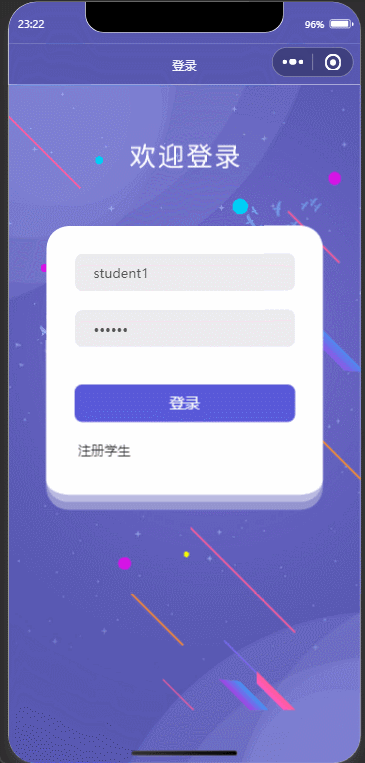

#  psychology-detection🎂

基于微信小程序的校园心理健康监测系统

## 介绍🌞

> 当前，校园心理健康工作面临着诸多挑战。一方面，传统的心理健康服务方式往往依赖于线下咨询和调查，这种方式不仅效率低下，而且覆盖面有限，难以满足广大学生的需求。另一方面，随着大学生心理问题的日益增多，对心理健康服务的精准性、及时性要求也越来越高。因此，开发一款基于Spring Boot的校园心理健康监测小程序，具有重要的现实意义和应用价值。


## 软件架构

> 本系统根据权限类型进行分类，主要分为学生微信端和管理员、心理老师服务端三大模块。




## 项目演示🌞

> 管理员


> 心理老师



> 学生






## 安装教程🌞

```
1. 运行环境准备mysql8 + java8 + node14.16.1

2. 配置maven路径，加载依赖

3. 运行sql文件，确保application.yml或config.properties的数据库名称和账号密码是数据库所在主机的账号密码
```


## 使用说明🌞

```
1. 登入

      管理员账号：admin 密码：123456 
      
      心理老师账号：003 密码：123456 
      
      学生账号：123456@qq.com 密码：123456
  
2. 运行流程

SpringBoot+Vue项目的部署详情可以查看这篇CSDN博客：http://t.csdnimg.cn/kpuxS

前后端不分离项目的部署流程可以查看这篇CSDN博客：http://t.csdnimg.cn/CslA5
```


## CSDN项目合集🌞

点击前往：http://t.csdnimg.cn/Q4u84


## 联系我🌞

**有偿获取完整源码或调试代码**

🐧：1902317191

微信：


